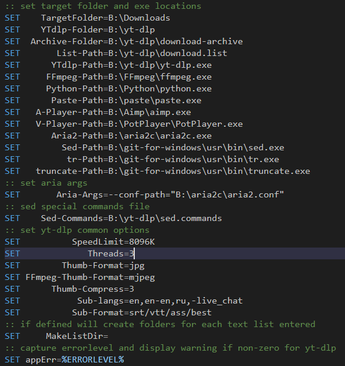
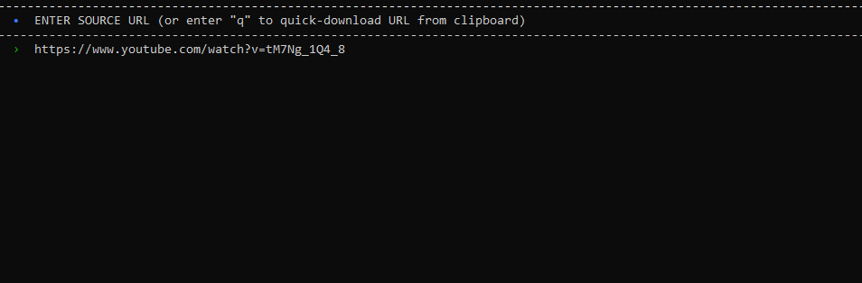
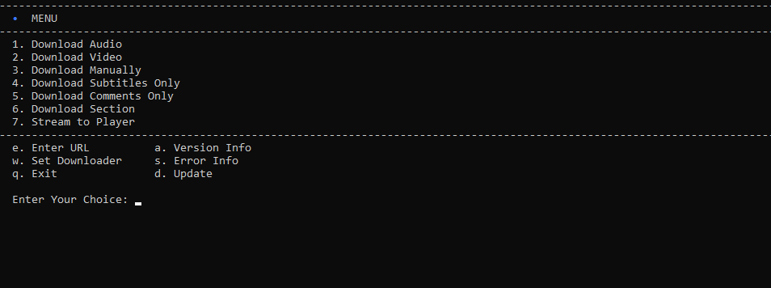
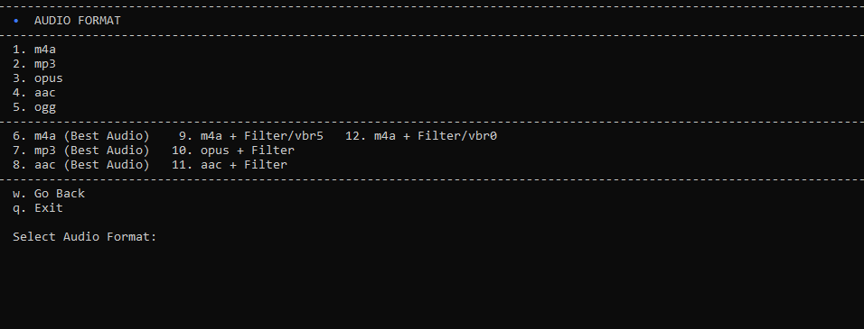
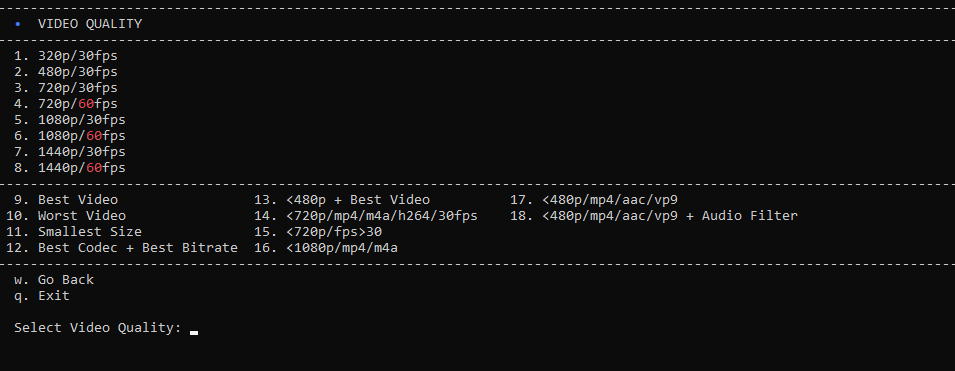
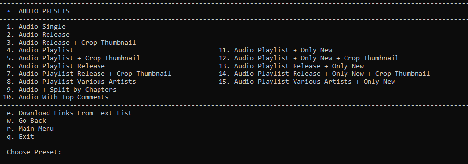
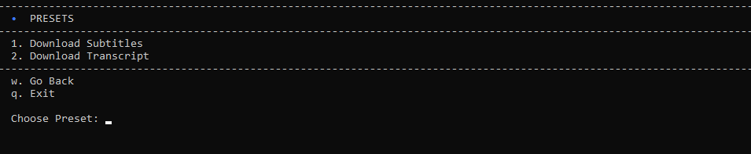
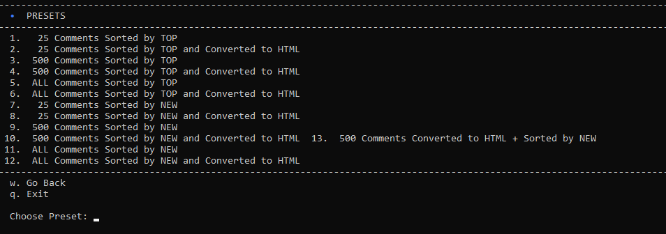
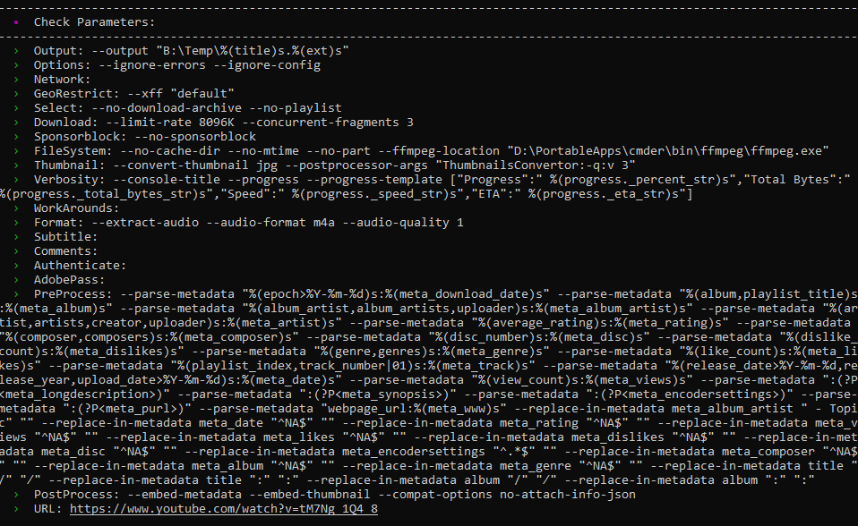
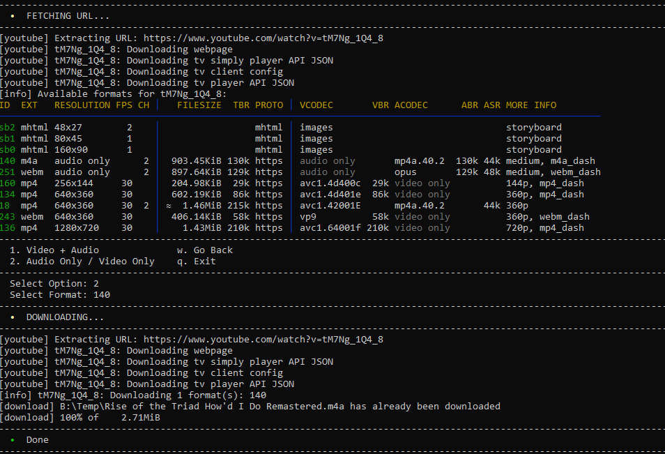

# yt-dlp.cmd

A batch (cmd) file made to simplify the usage of yt-dlp on Windows.  

- Supports drag and droping for .url files and text files with links (one per line).  
- Can download a link from clipboard with default preset (change it for your needs).  
- Offers many built-in presets for Audio and Video (all is optional).  

Not that it's been tested very well... Suggestions for good presets are welcome.

## yt-dlp_nest_comments_fork.py and yt-dlp_nest_comments_new.py
Python scripts by [many](https://gist.github.com/tinyapps/df2b6757a142ff93caf9c63d0ef38b11) authors to prettify downloaded comments and make them readable.

## sed.commands
Text file with sed commands needed to make subtitles more readable.

## Requirements
-  sed, tr, truncate - Linux/Unix utils ported to Windows. [Included](https://github.com/git-for-windows/git) in git for Windows (you may choose PortableGit.7z variant in releases).  
-  aria2c - to use as external downloader if needed. Choose version from [SourceForge](https://sourceforge.net/projects/aria2.mirror/) to avoid certificate files problem on Windows.  
-  [paste](https://gist.github.com/jpflouret/19da43372e643352a1bf) - to pipe contents of Windows clipboard. Download [here](https://gist.github.com/jpflouret/19da43372e643352a1bf#file-paste-zip).  
-  [Python](https://www.python.org/downloads/windows/) - to run .py scripts.  
-  [FFmpeg](https://github.com/BtbN/FFmpeg-Builds) - to merge video and audio files (and a lot more).  

Fill-in the settings (example).

## Screenshots

  
  
  
  
  
  
  
  
  

## Contribute
Feel free to fork and contribute if you wish.

## Questions

**- Can you code?**  
_- No_.  
**- Do you know batch?**  
_- No_.  
